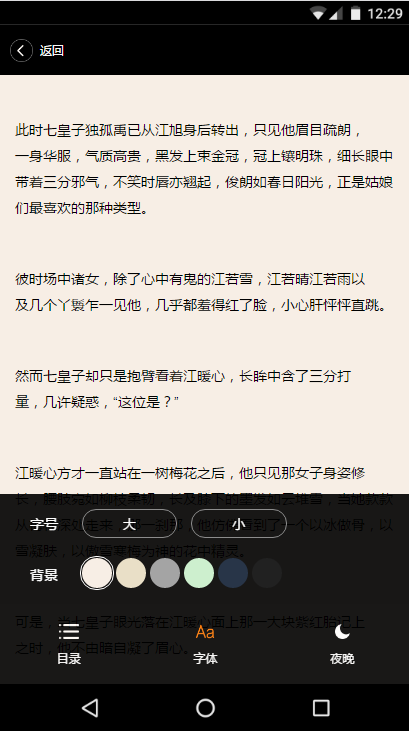

## WebReader
This is my project that contact to Ajax,JSONP,localStorage and Others, which is a Web-reader that you could change font-size, background-color, read next chapter and so on.From this project,I learn some CSS skills,HTML5 knowledge and somethings about JavaScript Design pattern.I will keep on finishing it make it better.

这是我学习并完成的一个 web 阅读器小项目。这个项目包含了很多知识，诸如接触 Ajax,JSONP,HTML5 new API 和设计模式等等其他一些知识点。对我来说是一次全新的体验。虽然项目现在可以跑在服务器上并完成已有的功能，但在我看来这个项目现在还未全部完成，我希望以后能把它做得更完整。

